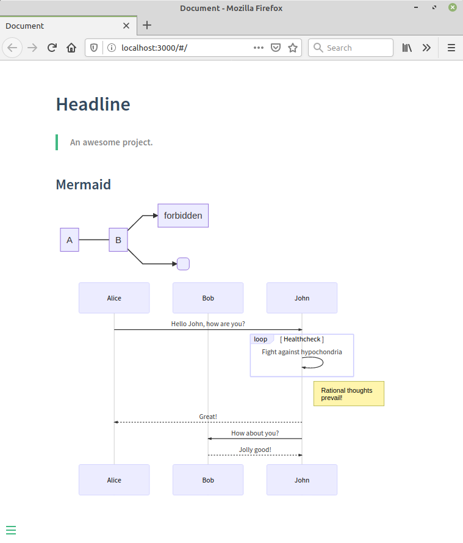

mermaid-docsify is a docsify plugin which allows to render mermaid diagrams in docsify.

## How to use

Add Mermaid and the plugin:

```html
  <script type="module">
    import mermaid from "https://cdn.jsdelivr.net/npm/mermaid@10/dist/mermaid.esm.min.mjs";
    mermaid.initialize({ startOnLoad: true });
    window.mermaid = mermaid;
  </script>
  <script src="//unpkg.com/docsify-mermaid@2.0.0/dist/docsify-mermaid.js"></script>
```

You can optionally customize [mermaid.run](https://mermaid.js.org/config/usage.html#using-mermaid-run) configuration with this props :

```html
  <script>
    window.$docsify = {
      mermaidConfig: {
        querySelector: ".mermaid"
      }
    };
  </script>
```

Now you can include mermaid diagrams in your docsify docs:

    ```mermaid
    graph LR
        A --- B
        B-->C[fa:fa-ban forbidden]
        B-->D(fa:fa-spinner);
    ```

A demo is available on [Codepen](https://codepen.io/leward/project/editor/AyegJW).


